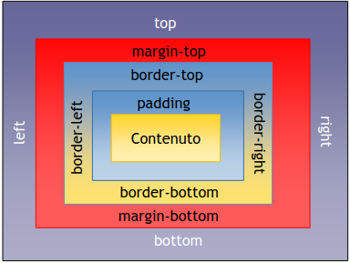

# CSS
CSS (Cascading Style Sheets), "Cascading" indica che possiamo definire lo stile in diversi punti, e in base a dove lo definiamo ha più o meno priorità. 
I livelli inferiori prendono lo stile di quelli superiori.

Se si hanno dubbi se una certa funzionalità css è o meno supportata da un browser si può consultare il sito [CanIUse](https://caniuse.com/).

## I Fogli di stile
Insieme di regole che indicano la formattazione da apllicare.

Vantaggi:
- separaziona della grafica dalla struttura
- controllo più preciso dell'aspetto grafico
- manutenzione più facile
- dimensioni ridotte
- semplice da capire


Se l'orine con cui compaiono le cose non dipende più dal layot, da cosa dipende?
L'ordine con cui metto gli oggetti dipende dal motore di ricerca, quello che voglio far vedere al motore di ricerca lo metto per primo.
In più cerco di strutturare il sito per agevolare gli screen reader.

## Regole di sintassi 
La sintassi di una regola è: `selettore {blocco di dichiarazioni}`
- I selettori sono:
    - selettori di tag:
        - `h1 { color:red; font-family: Helvetica, sans-serif;}`
        - indica che **tutti** gli h1 del documento devono essere rossi e col font Helvetica, se non trova Helvetica usa il font sans serif.
    - selettori di id
    - selettori di classe
- Blocco di dichiarazioni è un insieme di coppie:
```
{
    proprietà: valore;
    proprietà: valore;
    ...
}
```


Regola per i font:
- su dispositivi elettronici si devono usare font senza grazie
- su carta stampata si usano font con grazie
Questo perché rispettivamente questi font aiutano alla lettura. 
Alcuni font possono essere più o meno difficili da leggere per le persone con dislessia.

## Come applicare il CSS
- Attraverso l'attributo "style" dei tag. 
NON SI FA MAI, perché non separa contenuto da presentazione.
- Css enbedded: si mettono le regole nel tag `<style>` all'interno del `<head>`. 
Separa un po' meglio, ma non è comunque il massimo perché se voglio usare su più pagine lo stesso stile allora devo ripetere questo codice su ogni pagina.
```
<html>
    <head>
        <style type=“text/css”>
            h1 {color: red;}
            p {font-family: sans-serif;}
        </style>
    </head>
... testo del documento ...
</html>
```
- Fogli di stile esterni: è il modo migliore per dividere contenuto e presentazione. 
Lo stesso foglio di stile può essere usato su più pagine. 
È possibile importare più fogli di stile, l'ultimo ha la precedenza.
```
<html>
    <head>
        <link rel=“stylesheet” href=“stile.css” type=“text/css”>
    </head>
    ... documento ...
</html>
```

Siccome una pagina può essere visualizzata su più dispositivi possiamo indicare quali fogli di stile usare in base al dispositivo.
Per fare ciò si usa l'attributo `media`, che può avere i seguenti valori:
- `all`: è di default, applica il foglio a tutti indistintamente. Come tutti i valori di default si può anche non mettere per risparmiare bit 
- `screen`: per indicare dispositivi con schermo.
Per distinguere tra pc e dispositivi mobili si deve fare un controllo ulteriore e si applica il foglio di stile in base alla dimensione dello schermo.
- `print`: il foglio di stile che si applica per quando la pagina viene stampata.
- `speech`: c'era una volta per indicare gli screen reader, ma ora non viene più usato.

```
<html>
    <head>
        <title> Esempio con differenti dispositivi </title>
        <link rel=“stylesheet” media=“screen” href=“screen.css” />
        <link rel=“stylesheet” media=“print” href=“print.css” />
        <link rel=“stylesheet” media=“speech” href=“screenreader.css” />
    </head>
    ... documento ...
</html>
```
Per fare il controllo sulla dimensione dello schermo:
```
media="screen and (max-width:480px), only screen and (max-device-width:480px)"
```
La differenza tra `max-width` e `max-device-width` è che `max-width` è la larghezza della finestra, mentre `max-device-width` è la larghezza del dispositivo. 
Nei cellulari questi due valori sono la stessa cosa, quindi si può lasciare `max-width`. 
Occhio che magari se sono su pc e rimpicciolisco troppo la finestra non passi alla modalità telefono.

Un altro modo per inserire il css è con `@import`. Sconsigliata.
```
<html>
    <head>
        <style type=“text/css”>
            @import url(“file.css”) print;
        </style>
    </head>
    ... testo del documento ...
</html>
```
È una via di mezzo tra un enbedded è un foglio di stile esterno. 
Si trova quando si importano font esterni. 
Un tempo veniva usato per nascondere certe cose a browser molto vecchi, oggi non ha più senso.

## Regole di applicazione
Uno stile applicato ad un elemento viene applicato automaticamente anche a tutti i suoi sottoelementi.
La regola viene ereditata dai figli a meno che questi non la sovrascrivano.
```
<body style=“color: blue”>
    <div> ... testo blu... </div>
    <div style=“color: green”>
        ... testo verde...
    </div>
    <div> ... testo blu... </div>
</body>
```
### Procedimento a cascata
Ordine di prirità quando si applicano le regole di stile:
1. Impostazioni personali dell’utente
    - dimensioni del font o estensioni che modificano la pagina
2. Impostazioni di stile inline definite dall’autore della pagina
3. Fogli di stile embedded definiti dall’autore
4. Fogli di stile esterni definiti dall’autore
5. Impostazioni di stile predefinite del browser
    - impostazioni utilizzate quando qualcosa non è definito o se il browser non supporta i CSS
    - cambiano da browser a browser
Dall'alto verso il basso è l'ordine di priorità, dal basso verso l'alto è l'oridine di applicazione. 
QUESTA È UNA DOMANDA D'ESAME.

Per aiutare gli sviluppatori è stata introdotta la definizione di importanza.
Se una regola, ovunque si trovi, ha la clausola `!important` davanti questa automaticamente sale al livello 2 di priorità (solo le impostazioni dell'utente la possono sovrascrivere).
```
selettore { proprietà: valore !important; }
```
Quindi l'ordine diventa così:

1. Impostazioni personali dell’utente
2. Dichiarazioni definite con `!important`
3. Impostazioni di stile inline definite dall’autore della pagina
4. Fogli di stile embedded definiti dall’autore
5. Fogli di stile esterni definiti dall’autore
6. Impostazioni di stile predefinite del browser

Generalmente, `!important` viene usato quando non ho capito perché la mia regola di stile non viene visualizzata. 
Indica quindi che c'è un errore da qualche parte. 
NON USARLO, la prof lo penalizza.

L'unico caso in cui si può usare è se si sta lavorando con dei framework e quindi non si ha il pieno controllo su tutte le regole applicate.

L'uso dell'`!important` è scoraggiato non solo per una questione di purezza del codice ma anche per via delle performance.
Noi vogliamo che il browser renderizzi il pià velocemente possibile le nostre pagine.
Più è complicato il css, più linee ha, più ci metterà il browser a caricare. 
Il browser comincia ad applicare regole, quando una regola viene sovrascritta deve tornare indietro e riapplicare tutto. 
L'`!important` tipicamente fa questo, va a sovrascrivere qualcosa di già caricato e porta il browser a dover fare lavoro in più.

## Selettori
Abbiamo detto che la sintassi è `selettore {regola}`.
I selettori indicano qual è il tag a cui voglio applicare la mia regola.
- Selettori di tipo: si riferiscono all'elemento da formattare
    - `p { font-size: 1em; }`
- Selettori di attributo: valori degli attributi class e id
    - Per selezionare una classe:
        - `.nomeClasse {font-weight: bold}`
    - Per selezionare un attributo id:
        - `#nomeId {color:blue}`

Il seguente paragrafo avrà tutte i gli stili scritti sopra:
```
<p id="nomeId" class="nomeClasse">Esempio</p>
```


La seguente regola si applica solo ai paragrafi con classe "grande":
```
p.grande {font-size: 2.5em; }
```

Un tag può avere un'unico id ma può avere più classi.
Quando si assegnano le classi al tag si separano da uno spazio.

Se ci sono confilitti viene applicata la regola più specifica. 
Se il conflitto avviene tra regole con pari specificità viene applicato l'ultimo inserito.

- Selettore universale
    - `* {font-weight: bold;}
    - si applica a TUTTO
- Raggruppamento di selettori
    - applica le regole a tutti i tag elencati (l'ordine non è rilevante)
    - `h1, h2 {color: blue; font-size: 10pt; }`
- Figli e discendenti
    - l'ordine è rilevante
    - `p em {...}` applica le regole a tutti gli `<em>` contenuti all'interno di un `<p>`, anche se non non c'è discendenza diretta(ovvero se ci sono altri tag in mezzo)
    - se si vuole applicare le regole solo ad attributi figli si fa cosi:
        - (esempio) `body > p {...}`
- Selettori di adiacenza
    - `h1 + h2 {...}`
        - tutti gli `<h2>` che vengono immediatamente dopo un `<h1>`
        - `<h1>` qui non viene influenzato

### Selettori di attributo
Sintassi: `elementname[attributename=attributevalue]`.
Permettono di selezionare un elemento sulla base del valore di un attributo dato.\
Esempi:
- `abbr[title]` : tutte le abbreviazioni che hanno un attributo `title`, indipendentemente dal valore
- `abbr[title="mio titolo"]`: tutte le abbreviazioni con attributo `title` uguale alla stringa “mio titolo”
- `abbr[title~="mio titolo"]` : tutte le abbreviazioni con attributo title contenente la stringa “mio titolo”

## Ereditarietà e specificità 
- Ereditarietà : ogni figlio eredita le impostazioni del padre
- Se vengono definite più regole con la stessa importanza per uno stesso elemento, l'ultima definita è quella che verrà applicata (appato che anche la specificità sia la stessa)

## Specificità 
Oltre all'ordine di priorità menzionato prima:
>1. Impostazioni personali dell’utente
>2. Dichiarazioni definite con `!important`
>3. Impostazioni di stile inline definite dall’autore della pagina
>4. Fogli di stile embedded definiti dall’autore
>5. Fogli di stile esterni definiti dall’autore
>6. Impostazioni di stile predefinite del browser

ricordando che:
>Dall'alto verso il basso è l'ordine di priorità, dal basso verso l'alto è l'oridine di applicazione. 

aggiungiamo anche il concetto di specificità.

La specificità richiede calcoli piuttosto complessi, che a volte possono essere fonte di errore nei browser.\
ATTENZIONE: **solo quando due regole sono in conflitto** la speficità entra in gioco.\
Si calcolano tre valori: *(num id, num attributi, num tag html)* (sono in ordine di importanza da sinistra verso destra).\
ATTENZIONE: 
- Le classi sono contate come attributi.
- Gli id che sono dentro alle quadre di un attributo non si contano come id ma come attributo.

Si legge il numero a sx, se sono diversi ha priorità quello più alto, se sono uguali si passa al numero in mezzo e si ripete il ragionamento.
```
#nav a {color:orange;} /*(1, 0, 1)*/
a {color:blue;} /*(0, 0, 1)*/
/* In questo caso ha precedenza il primo */
```
In caso di regole che usano la parola `!important` la specificità viene calcolata su 4 valori, in cui la presenza della parola chiave `!important` ha priorità sugli altri.

## Pseudoclassi
Non è una classe che io definisco tramite l'attributo `class`, ma è uno stato che un elemento può assumere.\
Sintassi: `selettore:pseudoclasse { ... }`
- Es: `a:link:hover{ font-size: 2em; }`

PSEUDOCLASSE | RISULTATO
--------------|-----------
:link | link non visitato
:visited | link visitato
:active | link attivo
:hover | vi si trova sopra il mouse
:focus | elemento attivo (tab)
:first | prima pag per media paginati
:left | pagine di sinistra
:right | pagine di destra
:first-child | prima occorrenza
:lang | seleziona una lingua


ATTENZIONE: `:hover` funziona SOLO su desktop.

## Pseudoelementi
PSEUDOCLASSE | RISULTATO
--------------|-----------
:first-letter | prima lettera di un blocco
:first-line | prima riga di un blocco
:before | testo da aggiungere prima di un elemento
:after | testo da aggiungere dopo un elemento

Attenzione: in CSS3 possono essere usati per aggiungere del contenuto ma questo contenuto NON è raggiungibile dagli screen reader e dai motori di ricerca.

## Sistemi di misura
Esistono diverse unità di misura in CSS, si dividono in:
- relative: ex, em, percentuale, rem, vh, vw
- assolute: cm, mm, in, pt, px, pc

Si usano SEMPRE quelle relative.\
Le unità assolute si usano:
- per le media query (tipo vedere quanto è larga una pagina)
- per indicare lo spessore di un bordo


Unità | Definizione
------|------------
em|Altezza media del font utilizzato
px|Numero di pixel nello schermo
in|Inch, pollici (1 in = 2,54 cm)
cm|Centimetri
mm|Millimetri
pt|Punti (1 pt = 1/72 pollici)
pc|Pica (1 pc = 12 punti)
%|Valore in percentuale relativo a quello dell’elemento principale

## Definizione dei colori
- Colori predefiniti
    - white, red, green
- Espressi in formato RGB (Red, Green, Blue)
    - \#RRGGBB
        - \#FFFFFF è il bianco
        - se invece di sei numeri ne ho tre, ogni numero si ripete due volte
    - rgb(y,y,y) oppure rgb(y%,y%,y%)
- Colori che funzionano su tutti i browser:
	- aqua
	- black
	- blue
	- fuchsia
	- gray
	- green
	- maroon
	- navy
	- olive
	- purple
	- red
	- silver
	- lime
	- white
	- teal
	- yellow
	- Tutti i colori composti dai codici 00, 33, 66, 99, CC, FF

## Definizione degli URL
Gli URL vengono definiti in questo modo: `url(protocollo://server/percorso)`
Esempio:
```
body{
    background-image:url(percorso/imagine.gif);
    background-repeat:repeat;
}
```

## Testo
### La scelta del carattere
Se noi non scegliamo un carattere il carattere che viene visualizzato è quello definito dal browser.\
Oggi gli utenti sono abituati al fatto che il tipo di carattere scelto veicoli l'informazione (si aspettano che anche il font gli comunichi qualcosa).\
Con CSS3 i font si possono importare, quindi si può dire al browser dove trovare il font nel caso questo non fosse presente sul sistema.\
Due regole essenziali:
- Usare i font senza grazie per il testo che si visualizza su schermo e con grazie per quello su carta
- Cosa simile per la giustificazione:
    - Su schermo : la giustificazione parte a sinistra con una linea unica(tutte le parole iniziano allo stesso momento) mentre a destra la frase finisce con l'ultima parola che ci sta (a bandiera).
    - Su stampa: linea dritta sia a sinistra che a destra (aiuta la lettura).

### Font
Possono essere:
- Proporzionali: ogni carattere occupa una diversa quantità di spazio
    - Più facili da leggere
    - Es. Times, Helvetica, Arial
- A larghezza fissa: ogni carattere usa la stessa quantità di spazio
    - possono favorire l'impaginazione quando c'è bisogno di incolonnare testo
    - Es. Courier, Monaco

Evitare i font caligrafici o comunque font particolari. 
Nonostante riescano a dare un significato in più, stancano molto la lettura.

### Dimensioni del testo
È bene usare unità relative. Toglie punti se si usano dimensioni fisse.\
Ad oggi se si definisce in pt o px il font i browser lo ignorano e si adattano alle impostazioni dell'utente.

### Dare stile al testo
- Dimensione: `font-size`
- Interlinea: `line-height`
    - Deve essere almeno 1.5 perché sia accessibile
- Sovvrapposizione : `z-index`
    - Qunado ci sono delle cose che si sovrappongono, per decidere cosa sta sotto e cosa sta sopra
- Corsivo: `font-style` (valore più utilizzato italic)
- Livelli di grassetto: `font-weight` (bold, normal, bolder,lighter,…)
- Variante maiuscoletto: `font-variant` (ex: small-caps)
- Maiuscolo o minuscolo: `text-trasform` (uppercase, lowercase)
- Decorazione: `text-decoration` (underline, overline, line-through, none)
    - Da usare con molta cautela perché se si sottolinea una parola questa si intende sia un link
- Colori: `color` e `background-color` specificano colore del testo e dello sfondo

### Per definire tutto insieme
Per ridurre la dimensione del foglio di stile è possibile specificare tutto insieme tramite la proprietà scorciatoia `font:`
- Sintassi:
    - `selettore { font: font-style font-variant font-weight font-size/line-height font-family }`
- Esempio:
    - `p { font: italic small-caps bold 0.8em/1.5 arial, Helvetica, sans-serif}`

ATTENZIONE: se si usa `font` e non si assegna un valore a ogni attributo, tutti gli attributi non specificati vengono riscritti con valori di default.

### Incorporare font esterni
La regola `@font-face` permette di scaricare ed utilizzare font personalizzati:
- `@font-face{ <descrizione del font>}`
La descrizione del font contiene delle coppie `descrittore:valore` dove descrittore può essere:
- `font-family`: nome da associare al font
- `src`: local(PERCORSO_LOCALE)/url(URL)
- `font-style`, font-weight, font-variant e font-stretch

Attenzione alle licenze d’uso e al supporto dei browser.

### Altri elementi per dare stile al testo
(Difficile che si userano mai ma giusto per sapere che ci sono).
- Distanza tra le lettere: `letter-spacing`
- Distanza tra le parole: `word-spacing`
- Indentazione: `text-indent`
- Allineamento orizzontale: `text-align`
- Allinemento verticale: `vertical-align`

## Immagini e il CSS
Tramite CSS si può dare uno stile alle immagini proprio come al testo. Si può però anche inserire delle immagini tramite CSS.\
Il decidere se un'immagine va inserita con il tag `` o come background di qualcosa non è una decisione che va presa sulla base di qual è il risultato finale.
Perché nella stragrande maggioranza dei casi si può ottenere lo stesso risultato nei due modi. 

- Se l'immagine è l'ancora di un link si usa ``
- Se l'immagine porta del contenuto questo contenuto va portato anche a chi non può vedere l'immagine. 
L'unico modo per farlo è mettere un `` con l'attributo `alt`. 
Questo aiuta anche nel ranking.

Se invece l'immagine non è di contenuto ma solo decorativa, è meglio inserirla come background. Non è sempre possibile. Per le immagini solo decorative si mette l'`alt` vuoto.

Per separare struttura da presentazione, una buona tecnica è inserire le immagini
come background di `<div>` o altri elementi:
`body { background-image: url(images/miagif.gif);}`
Altre proprietà:
- `background-attachment`: stabilisce se l’immagine segue il contenuto nello scroll oppure no
- `background-repeat`
- `background-position`, di default è nell'angolo superiore sx

### Tutto insieme
Come per i font è possibile usare una scorciatoia per definire tutto insieme:
```
selettore { background: background-color background-image background-repeat background-attachment background-position }
```
Esempio:
- `p { background: #fff url(images/mygif.gif) top left fixed norepeat;}`
ATTENZIONE: diversamente da font, l’ordine con cui vengono specificate le proprietà non è rilevante.

Ricordarsi di mettere come colore di fallback il colore predominante nell'immagine, nel caso in cui l'immagine non si caricasse.

## Dimensioni di un elemento



- Con `width` ed `height` in realtà non definiamo le dimensioni di un elemento, ma solo del suo contenuto:
- Es: un elemento di dimensioni 100x50 con bordo, padding e margine di 50px su tutti i lati, in realtà misura 400x350px
- CSS definisce anche `min-width` e `min-height`.
- overflow: controlla la visualizzazione del contenuto che sporge dalla dimensione del box. Valori: `visible`, `hidden`, `scroll`, `auto`.
- Gli fondi, sia immagini che colori, occupano l’area del contenuto e del padding
    - Il background copre il padding ma non il margine.

Per avere una preview dei bordi provare su [border-radius](http://border-radius.com/).

## Display
Gli elementi si dividono in due gruppi:
- di blocco (`<div>`, `<p>`, ...)
- in linea (`<em>`, `<span>`)
È possibile modificare questa caratteristica tramite la proprietà `display`
- `display:none` impedisce la visualizzazione
- Può essere usato per eliminare alcune parti dalla stampa
- Non è utile per le pagine per i non vedenti visto che nasconde il blocco anche agli screen-reader

## Come si posizionano i blocchi
Due metodi
- Con la versione CSS2 dei fogli di stile è possibile abbandonare completamente l’uso delle tabelle perché è possibile agire sulla disposizione degli elementi nella pagina.
    - si parte da un posizionamento statico e poi si va a modificare la proprietà di `float`
- In CSS3
    - Proprietà `flex`
    - Proprietà `grid`, appesantisce il rendering soprattutto se annidate

Posizionamento statico e dinamico:
- Il posizionamento statico (default) dispone il box secondo il flusso normale
- Il posizionamento relativo inizialmente calcola la posizione del box secondo il flusso normale, poi sposta il box delle proprietà top, bottom, right e left. 
Questo spostamento non ha effetti sul posizionamento dei box successivi.

Nello scritto c'è:
- un es su una tabella accessibile
- un es sulle regole di specificità
- chiede qual è la regola più specifica e cosa viene applicate
- due domande aperte
- delle domande a crocette

Domanda d'esame: Differenza tra attributo `id` e `class`.
- L'`id` permette di identificare un unico tag mentre `class` un insieme di tag
- Hanno una diversa specificità
- `id` può essere usato come destinazione di un link


